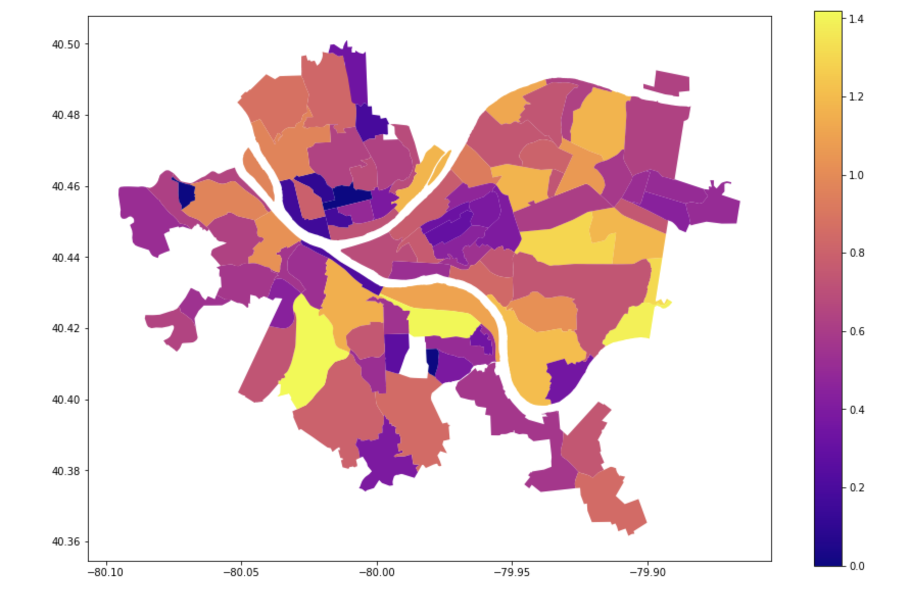

# CMPINF 0010 Final Project
By Daphne Giffin, Jack Cetani, and Morgan Engel

## Which neighborhood in Pittsburgh is the best for kids?

Our goal is to use three Pittsburgh data sets to determine the best neighborhood in Pittsburgh for kids. We will be using the parks, education, and police incident data sets (linked below). Using these metrics we can determine an overall score for each neighborhood, as well as the best one for kids.

In conclusion...
## Beechview is the best Pittsburgh neighborhood for kids!

### *Higher score means better neighborhood*
Beechview had an overall score of 7.2, with submetric overall scores:
Crime Score: 1.0
Park Score: 0.71
Education Score: 0.46

## Datasets Used:
1. [Police Incident Blotter (30 Day)](https://data.wprdc.org/dataset/police-incident-blotter)
2. [Parks](https://data.wprdc.org/dataset/parks)
3. [IEP by Neighborhood 2020-21 school year](https://data.wprdc.org/dataset/pittsburgh-public-schools-individualized-education-plan-iep/resource/62403582-e6c3-40b6-9bb6-d5d38e3f058d)

